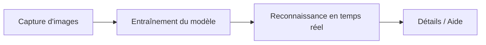

# Reconnaissance de Fruits

Application de bureau en **Python** pour **reconnaître des fruits** à partir d’une webcam, grâce à un modèle de **deep learning** (réseau de neurones convolutifs — CNN) entraîné sur vos propres images.

L’interface graphique est construite avec **PySide6** (Qt). Le pipeline couvre la **capture de données**, l’**entraînement du modèle**, la **reconnaissance en temps réel**, une **encyclopédie** sur les fruits et une page **Aide** intégrée.

---

## Sommaire

- [Fonctionnalités](#fonctionnalités)
- [Prérequis](#prérequis)
- [Installation](#installation)
- [Lancement](#lancement)
- [Parcours utilisateur](#parcours-utilisateur)
- [Guide détaillé par écran](#guide-détaillé-par-écran)
  - [Animation de démarrage](#1-animation-de-démarrage)
  - [Capture d’images](#2-capture-dimages)
  - [Entraînement du modèle](#3-entraînement-du-modèle)
  - [Reconnaissance en temps réel](#4-reconnaissance-en-temps-réel)
  - [Détails sur les fruits](#5-détails-sur-les-fruits)
  - [Aide](#6-aide)
  - [Auteurs](#7-auteurs)
- [Structure du projet](#structure-du-projet)
- [Configuration](#configuration)
- [Dépannage](#dépannage)
- [Technologies](#technologies)
- [Licence et usage](#licence-et-usage)

---

## Fonctionnalités

| Module | Description |
|--------|-------------|
| **Capture d’images** | Collecte automatique de photos via webcam, classées par fruit dans `dataset/` |
| **Entraînement** | Entraînement d’un CNN (TensorFlow) avec augmentation de données et suivi des logs |
| **Reconnaissance** | Identification en direct avec score de confiance et synthèse vocale (pyttsx3) |
| **Détails** | Fiches descriptives (origine, saison, bienfaits, etc.) et possibilité d’ajouter un fruit |
| **Aide** | Documentation intégrée (onglets par fonctionnalité) |
| **Auteurs** | Présentation de l’équipe et remerciements |

---

## Prérequis

- **Python 3.8** ou supérieur (testé avec Python 3.8)
- **Webcam** fonctionnelle (port par défaut : `0`, configurable dans `donnees/config.json`)
- **Windows** recommandé (l’application a été développée sous Windows)
- Espace disque suffisant pour le dossier `dataset/` et le modèle entraîné (`donnees/modele_fruits.h5`)

---

## Installation

1. **Cloner** le dépôt :

```bash
git clone https://github.com/VOTRE_UTILISATEUR/FRUITS.git
cd FRUITS
```

2. **Créer un environnement virtuel** (recommandé) :

```bash
python -m venv venv
venv\Scripts\activate
```

3. **Installer les dépendances** :

```bash
pip install -r exigences.txt
```

Contenu de `exigences.txt` :

- `PySide6` — interface graphique  
- `opencv-python` — capture et traitement d’images  
- `numpy` — tableaux numériques  
- `tensorflow==2.10.0` — entraînement et inférence du modèle  
- `pyttsx3` — annonce vocale du fruit détecté  

> **Note :** TensorFlow 2.10 est une version ciblée du projet. En cas de conflit sur une autre version de Python ou d’OS, consultez la [documentation TensorFlow](https://www.tensorflow.org/install) pour une version compatible.

---

## Lancement

À la racine du projet :

```bash
python app.py
```

**Déroulement au démarrage :**

1. Une **fenêtre de chargement** animée s’affiche pendant **6 secondes** (`ANIME/demarrage.py` + GIF).
2. Le **thème bleu/noir** est appliqué à l’application.
3. La **fenêtre principale** s’ouvre avec le menu latéral et la page **Capture d’images** par défaut.

---

## Parcours utilisateur

Pour obtenir de bons résultats de reconnaissance, suivez cet ordre :



1. **Capturer** au moins **30 à 50 images** par fruit (idéalement 50+), sous plusieurs angles et éclairages.  
2. **Entraîner** le modèle jusqu’à une précision de validation satisfaisante (souvent ≥ 85 %).  
3. **Reconnaître** les fruits devant la webcam en ajustant le seuil de confiance si besoin.  
4. Consulter **Détails sur les fruits** pour enrichir vos connaissances ou ajouter de nouvelles fiches.

Le menu latéral permet de naviguer entre toutes les sections à tout moment.

---

## Guide détaillé par écran

Les captures ci-dessous se trouvent dans le dossier [`CAPTURES D'ECRAN/`](CAPTURES%20D'ECRAN/).

### 1. Animation de démarrage

Au lancement de `app.py`, l’écran de chargement affiche une animation (GIF) pendant le préchargement des composants.


- Durée fixe : **6 secondes**, puis fermeture automatique.  
- Ne fermez pas la fenêtre manuellement si possible ; la fenêtre principale s’ouvrira ensuite.  
- Fichiers associés : `ANIME/demarrage.py`, `ANIME/gif/demarrage.gif`.

---

### 2. Capture d’images

**Menu :** *Capture d’images* (icône appareil photo)

Cette page sert à **constituer le jeu d’entraînement**. Les photos sont enregistrées dans `dataset/<nom_du_fruit>/` (par ex. `dataset/pomme/1.jpg`, `2.jpg`, …).


#### Étapes d’utilisation

1. Dans la liste déroulante **« Sélectionner le fruit à capturer »**, choisissez le fruit (liste issue de `donnees/fruits_info.json`).
2. Réglez **« Nombre d’images par fruit »** (entre **10** et **100**, valeur par défaut **50**).
3. Cliquez sur **« Démarrer la session de capture »**.
4. Placez le fruit dans le **cadre vert** de la webcam ; une photo est prise **automatiquement toutes les secondes**.
5. Variez **angles**, **distance** et **arrière-plan** pendant la session.
6. La **barre de progression** et la grille **« Images capturées »** se mettent à jour en direct.
7. À la fin du quota, un message confirme la fin de la capture. Utilisez **« Arrêter la capture »** pour interrompre avant la fin.

#### Conseils

- Bon **éclairage**, fond **contrasté**, plusieurs **exemplaires** du même fruit si possible.  
- Répétez l’opération pour **chaque classe** (chaque type de fruit) que vous souhaitez reconnaître.  
- Les noms de dossiers dans `dataset/` correspondent aux noms de fruits (souvent en minuscules).

---

### 3. Entraînement du modèle

**Menu :** *Entraînement de modèle*

Une fois les images présentes dans `dataset/`, vous pouvez entraîner le CNN. Le modèle et les étiquettes sont sauvegardés respectivement dans :

- `donnees/modele_fruits.h5`  
- `donnees/etiquettes.pkl`


#### Panneau « Configuration de l’entraînement »

| Paramètre | Rôle | Valeur par défaut (`config.json`) |
|-----------|------|-----------------------------------|
| **Taille de l’image** | Résolution d’entrée du réseau (32×32 à 128×128) | 64×64 |
| **Taille du batch** | Nombre d’images par lot (8 à 128) | 32 |
| **Nombre d’époques** | Passages complets sur les données (5 à 100) | 20 |
| **Split de validation** | Part des données réservée à la validation (10 %, 20 %, 30 %) | 20 % |

#### Augmentation de données

Cochez **« Activer l’augmentation »** pour renforcer la robustesse du modèle :

- Rotation (±20°)  
- Décalage (±20 %)  
- Zoom (±20 %)  
- Retournement horizontal  

#### Lancer l’entraînement

1. Ajustez les paramètres si nécessaire.  
2. Cliquez sur **« Démarrer l’entraînement »**.  
3. Suivez la **barre de progression** et les **logs** (époque, perte, précision).  
4. À la fin : message de succès ou d’erreur ; le bouton redevient utilisable.

> L’entraînement s’exécute dans un **thread séparé** pour ne pas bloquer l’interface. Selon la taille du dataset et votre matériel, cela peut prendre plusieurs minutes.

---

### 4. Reconnaissance en temps réel

**Menu :** *Reconnaissance de fruits*

**Prérequis :** un modèle entraîné (`donnees/modele_fruits.h5` et `donnees/etiquettes.pkl` présents).


#### Zone webcam (gauche)

- Flux vidéo en direct avec **cadre de capture**.  
- Chaque image analysée alimente le **détecteur** (`src/modeles/detecteur.py`).

#### Zone résultats (droite)

| Élément | Description |
|---------|-------------|
| **Fruit détecté** | Nom du fruit reconnu |
| **Confiance** | Pourcentage et barre visuelle |
| **Seuil de confiance** | Curseur **30 % – 95 %** (défaut **70 %**) : en dessous, la détection est ignorée |
| **Synthèse vocale** | Bouton **Activée / Désactivée** — annonce le nom du fruit (délai ~3 s entre deux annonces identiques) |
| **Description / Famille** | Texte issu de `donnees/fruits_info.json` |

#### Utilisation

1. Présentez un fruit **centré** dans le cadre, avec un **fond contrasté** et un **bon éclairage**.  
2. Si rien n’est détecté : **baissez légèrement le seuil** ou changez l’angle.  
3. Si les fausses détections sont fréquentes : **montez le seuil**.  
4. Désactivez la voix si vous travaillez en environnement silencieux.

---

### 5. Détails sur les fruits

**Menu :** *Détails sur les fruits*

Encyclopédie intégrée : cartes par fruit avec image, description, origine, saison, bienfaits, etc.


#### Fonctions principales

- **Recherche / filtre** : retrouver rapidement un fruit dans la liste.  
- **Clic sur une carte** : ouvre la fiche détaillée (bouton **« Retour à la liste »** pour revenir).  
- **Ajout d’un fruit** : dialogue pour enrichir `fruits_info.json` et associer une image dans `assets/images_fruits/`.

Les illustrations proviennent du dossier `assets/images_fruits/<NomDuFruit>/`.

---

### 6. Aide

**Menu :** *Aide*

Documentation intégrée sous forme d’**onglets** : Introduction, Capture d’images, Entraînement, Reconnaissance, FAQ.


Consultez cette page pour :

- le **workflow** recommandé (capture → entraînement → reconnaissance) ;  
- les **paramètres** d’entraînement expliqués ;  
- des **conseils** (éclairage, nombre d’images, seuil de confiance) ;  
- les réponses aux **questions fréquentes**.

---

### 7. Auteurs

**Menu :** *Auteurs*

Présentation de l’équipe, remerciements (notamment au professeur **Mr MBIDA**) et mention des bibliothèques **TensorFlow**, **OpenCV** et **PySide6**.


> Projet à vocation **éducative** (« Exclusivement réservée à l’éducation »).

---

## Structure du projet

```
FRUITS/
├── app.py                    # Point d'entrée
├── exigences.txt             # Dépendances pip
├── ANIME/                    # Écran de démarrage (GIF + demarrage.py)
├── CAPTURES D'ECRAN/         # Captures pour la documentation
├── assets/                   # Icônes SVG, arrière-plans, images des fruits
├── dataset/                  # Images d'entraînement par classe (fruit)
├── donnees/
│   ├── config.json           # Configuration application / modèle
│   ├── fruits_info.json      # Métadonnées des fruits
│   ├── modele_fruits.h5      # Modèle entraîné (généré)
│   └── etiquettes.pkl        # Étiquettes des classes (généré)
└── src/
    ├── constantes.py
    ├── interface/            # Fenêtre, menu, pages, widgets, thèmes
    ├── modeles/              # Entraineur, Detecteur
    └── outils/               # Caméra, traitement image, TTS, données
```

Pour l’arborescence complète, voir aussi [`structure.md`](structure.md).

---

## Configuration

Le fichier [`donnees/config.json`](donnees/config.json) centralise les réglages :

```json
{
  "application": {
    "nom": "Reconnaissance de Fruits",
    "port_camera": 0
  },
  "modele": {
    "taille_image": [64, 64],
    "batch_size": 32,
    "epochs": 20,
    "chemin_modele": "donnees/modele_fruits.h5"
  },
  "interface": {
    "seuil_confiance": 0.7
  }
}
```

Vous pouvez modifier le **port caméra**, les hyperparamètres du modèle ou le **seuil de confiance** par défaut avant de relancer l’application.

---

## Dépannage

| Problème | Piste de solution |
|----------|-------------------|
| **Webcam introuvable** | Vérifiez qu’aucune autre application ne l’utilise ; changez `port_camera` dans `config.json` (0, 1, 2…). |
| **« Modèle non trouvé »** en reconnaissance | Lancez d’abord l’**entraînement** ; vérifiez la présence de `donnees/modele_fruits.h5`. |
| **Faible précision** | Capturez **plus d’images** variées ; activez l’**augmentation** ; augmentez le nombre d’**époques**. |
| **Erreur TensorFlow** | Utilisez Python 3.8–3.10 et `tensorflow==2.10.0` comme dans `exigences.txt`. |
| **Pas de synthèse vocale** | Installez les voix système Windows ; testez `pyttsx3` séparément. |
| **Écran de démarrage manquant** | Vérifiez que `ANIME/demarrage.py` et `ANIME/gif/demarrage.gif` existent. |

---

## Technologies

- **PySide6** — interface Qt  
- **OpenCV** — capture webcam et prétraitement  
- **NumPy** — manipulation des tableaux d’images  
- **TensorFlow / Keras** — CNN pour classification  
- **pyttsx3** — synthèse vocale  

---

## Licence et usage

Projet développé dans un cadre **pédagogique**. Consultez les auteurs pour toute réutilisation hors contexte éducatif.

**Auteur principal (interface du dépôt) :** DIBI Kre Michael — *Concepteur principal*  
Contact : dibikremichael@gmail.com

---

## Captures d’écran (index)

| Fichier | Écran |
|---------|--------|
| `animation de demarrage.png` | Splash / chargement |
| `capture d'images.png` | Capture pour le dataset |
| `entrainement de modele.png` | Entraînement CNN |
| `reconnaissance de fruits.png` | Reconnaissance live |
| `details sur les fruits.png` | Encyclopédie des fruits |
| `aide.png` | Documentation intégrée |
| `auteurs.png` | Équipe et remerciements |

Toutes ces images sont dans : **`CAPTURES D'ECRAN/`**.
